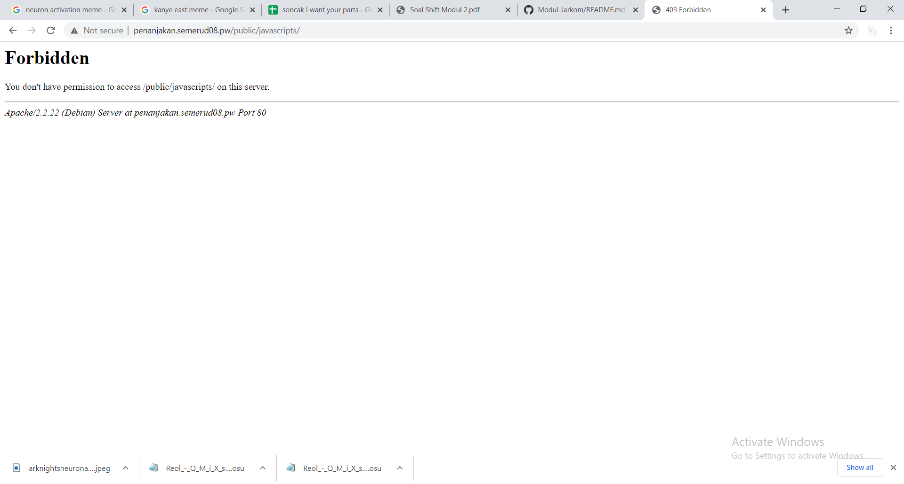

# Jarkom_Modul2_Lapres_D08
## DNS
### Soal 1
Untuk membuat sebuah website, dilakukan konfigurasi berikut ke /etc/bind/named.conf.local
Karena server MALANG digunakan sebagai Master, maka prosedur ini dilakukan di server MALANG


Lalu dibuatkan directory shift di /etc/bind/
File /etc/bind/db.local dicopy ke /etc/bind/shift/ dan direname menjadi semerud08.pw
Lalu dilakukan konfigurasi di file /etc/bind/shift/semerud08.pw sebagai berikut:


Agar site dikenali oleh client, maka dilakukan konfigurasi berikut di client di /etc/resolv.conf


### Soal 2
Untuk konfigurasi Alias website, ditambahkan line CNAME berikut dlm /etc/bind/shift/semerud08.pw


### Soal 3
Untuk konfigurasi subdomain website, ditambahkan line A berikut dlm /etc/bind/shift/semerud08.pw
IP diganti menjadi IP PROBOLINGGO


### Soal 4
Untuk menambah reverse DNS, ditambahkan konfigurasi berikut ke /etc/bind/named.conf.local


File /etc/bind/db.local dicopy ke /etc/bind/shift/ dan direname menjadi 79.151.10.in-addr.arpa, dan dilakukan konfigurasi sebagai berikut:


### Soal 5
Untuk mengatur server MALANG sebagai DNS master, ditambahkan line2 berikut dlm file /etc/bind/named.conf.local


Buka server MOJOKERTO, dan dilakukan konfigurasi juga di /etc/bind/named.conf.local agar MOJOKERTO dapat menjadi DNS slave


Dlm client, ditambahkan IP MOJOKERTO dlm /etc/resolv.conf


### Soal 6 & 7
Untuk membuat mendelegasikan subdomain dengan nama alamat http://gunung.semerud08.pw pertama kita harus mengkonsfigurasi pada server Malang di file bind yang kita buat dengan membuat ns1 dan di arahkan ke server Mojokerto

Kemudian di file named.local.conf kita buat allow transfer ke Mojokerto dan restart bind9 kita

Kemudian di server Mojokerto kofigurasi pada named.local.conf alamat http://gunung.semerud08.pw 

Kemudian di file gunung.semerud08.pw pada bind9 kita buat konfigurasi ke IP Probolinggo dan juga kita membuat subdomain di ke Probolinggo dengan nama naik

Coba ping pada pada client gunung.semerud08.pw dan naik.gunung.semerud08.pw


## Web Server
### Soal 8
Untuk mengatur webserver semerud08.pw, dibuat file semerud08.pw dari file default di /etc/apache2/sites-available dengan ServerName semerud08.pw , ServerAlias www.semerud08.pw, dan DocumentRoot /var/www/semerud08.pw
Isi folder semerud08.pw didapat dari zip semeruyyy.pw.zip yang telah disediakan oleh wget 10.151.36.202/semeruyyy.pw.zip
File zip di-unzip ke directory /var/www/ dan direname sesuai nama kelompok


### Soal 9
UNtuk membuat agar urlnya menjadi http://semeruyyy.pw/home. Kita dapat membuatnya dengan metode rewrite dan kita membuka .htaccess pada folder yang sama dengan dengan file semerud08.pw berada dan mengisinya seperti di bawah ini

Kemudian kita harus melakukan configurasi pada file semerud08.pw pada di sites-available di apache2 agar .htaccessnya dapat berjalan.

Hasilnya :

### Soal 10
Untuk mengatur webserver penanjakan.semerud08.pw, dilakukan langkah yang sama seperti semerud08.pw di no. 8
Isi folder penanjakan.semerud08.pw didapat dari zip penanjakan.semeruyyy.pw yang telah disediakan oleh wget 10.151.36.202/penanjakan.semeruyyy.pw.zip
File zip di-unzip ke directory /var/www/ dan direname sesuai nama kelompok


### Soal 11
Untuk mengatur Indexing maka diketikkan syntax sebagai berikut:


Public memiliki argumen +Indexes agar dapat diakses dan directory dibawahnya menggunakan -Indexing agar menolak akses.
Directory yang memiliki arg +Indexes dapat diakses seperti biasa, sedangkan yang memiliki arg -Indexes akan menunjukkan halaman 403 Forbidden



### Soal 12
Agar semua error 404 melakukan redirect ke error/404.html, maka ditambahkan line "ErrorDocument 404 /errors/404.html"


### Soal 13
Agar memudahkan mengakses /public/javascripts dengan hanya mengakses penanjakan.semerud08.pw/js, maka ditambahkan alias berikut:


Setelah diberikan alias, directory /js akan menampilkan halaman yang sama dengan dengan directory /public/javascripts


### Soal 14
Untuk mengatur web server naik.gunung.semerud08.pw, VirtualHost diganti dari 80 menjadi 8888, dan DocumentRoot diganti menjadi /var/www/naik.gunung.semerud08.pw


### Soal 15
Untuk membuat sistem authentation pada apache  pertama kita harus memiliki sebuat ultilitas yang disebut dengan htpasswd. Jika belum memilikinya kita harus mendownloadnya dengan cara mengetikkan perintah pada uml 
```c 
apt-get install apache2 apache2-utils
```
kemudian untuk membuat sebuah user kita dapat melakukannya dengan mengetikkan pada uml perintah 
```c
htpasswd -c /etc/apache2/.htpasswd semeru
```
beberapa saat kemudian akan ad perintah untuk membuat password dan kita harus mengisinya untuk membuat password yang kita inginkan. seletah itu kita melakukan configurasi pada naik.gunung.semerud08.pw dengan menambahkan syntax berikut
```c
ServerAdmin webmaster@localhost
    DocumentRoot /var/www/html
    ErrorLog ${APACHE_LOG_DIR}/error.log
    CustomLog ${APACHE_LOG_DIR}/access.log combined

    <Directory "/var/www/html">
        AuthType Basic
        AuthName "Restricted Content"
        AuthUserFile /etc/apache2/.htpasswd
        Require valid-user
    </Directory>
```
jika pada file naik.gunung.semerud08.pw sudah ad syntax di atas hanay perlu menambahkan syntax yang tidak ada saja dan jangan lupa untuk merestart apache. Kemudian lakukan konfigurasi pada apache2.conf dan temukan blok <Directory> untuk direktori /var/www yang menyimpan root dokumen. Aktifkan pemrosesan .htaccess dengan mengubah perintah AllowOverride dalam blok itu dari "None" menjadi "All" seperti contoh di bawah.
    ```c
        . . .

        <Directory /var/www/>
            Options Indexes FollowSymLinks
            AllowOverride All
            Require all granted
        </Directory>

        . . .
        ```

Hasil :

### Soal 16
Untuk membuat setiap melakukan pencarian pada browser dengan IP Probolinggo langsung menuju ke file semerud08.pw kita harus melakukan rewrite dengan cara membuat configurasi pada file .htaccess di folder sites-available dengan syntax seperti dibawah ini

Setelah itu lakukan configurasi pada file semerud08.pw dan default dengan menemukan blok <Directory> untuk direktori / var / www yang menyimpan root dokumen. Aktifkan pemrosesan .htaccess dengan mengubah perintah AllowOverride dalam blok itu dari "None" menjadi "All" seperti contoh di bawah.
    ```c
         . . .

        <Directory /var/www/>
            Options Indexes FollowSymLinks
            AllowOverride All
            Require all granted
        </Directory>

        . . .
    ```
    


### Soal 17

Untuk membuat setiap request gambar dengan substring semeru akan menuju ke semeru.jpg. Kita akan melakukan proses rewrite pada penajakan.semerud08.pw dengan melakukan configurasi pada file .htaccess dengan mengetikkan syntax berikut

Kemudian pada file penanjakan.semerud08.pw temukan blok <Directory /> dan biasanya ini berada di atas direktori / var / www yang menyimpan root dokumen. Aktifkan pemrosesan .htaccess dengan mengubah perintah AllowOverride dalam blok itu dari "None" menjadi "All" seperti contoh di bawah
```c
        . . .

        <Directory />
            Options Indexes FollowSymLinks
            AllowOverride All
        </Directory>

        . . .
  ```

